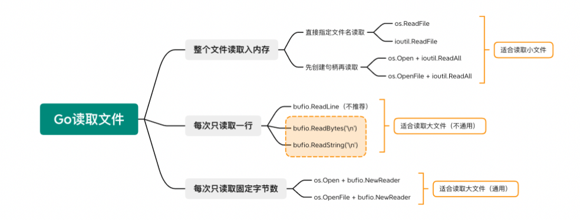

###1.文件读写
所以我们可以得知，go语言中读取文件的三种方法。

1. 读文件
第一种，我们可以使用切片的形式，定制一次读取文件的多少字节并用for循环来读取文件的内容。<br>
第二种，我们可以使用go语言内置的buffio包来一行一行的读取文件的内容。<br>
第三种，我们可以使用go语言内置的ioutil包来读取整个文件的所有内容。<br>
一次性读取所有的数据，太耗费内存，因此可以指定每次只读取一行数据。方法有三种：

bufio.ReadLine()
bufio.ReadBytes('\n')
bufio.ReadString('\n')
在 bufio 的源码注释中，曾说道 bufio.ReadLine() 是低级库，不太适合普通用户使用，更推荐用户使用 bufio.ReadBytes 和 bufio.ReadString 去读取单行数据。
2. 打开文件
第一种 os.Open() 只读形式打开文件
第二种 os.OpenFile()函数能够以指定模式打开文件，从而实现文件写入相关功能
``` os.O_CREATE:创建
    //os.O_WRONLY:只写
     
     //os.O_APPEND:追加
     //os.O_RDONLY:只读
     //os.O_RDWR:读写
     //os.O_TRUNC:清空
  
     //0644:文件的权限 
```

3.写文件
1. 写字符串 WriteString("\n") 
2. 写[]byte str := "你好啊\n" file.Write([]byte(str))
3. bufio.NewWriter    循环写文件
    ```writer := bufio.NewWriter(file) //往文件里面写入内容，得到了一个writer对象
           for i := 0; i <10; i++ { //循环写入10行
               writer.WriteString("test\n") //将数据写入缓存
           } 
4. ioutil.WriteFile 整个写文件
``` str := "Hello Golang！"
        err := ioutil.WriteFile("./ioutil.txt",[]byte(str),0664)//接收文件名，字节类型的数据，文件的权限
        if err != nil{
            fmt.Printf("打开文件失败,错误为:%v\n",err)
            return
        } 
```` 
### 2.面向对象
2.1  结构体
* 规则一：当最后一个字段和结果不在同一行时，, 不可省略 反之，不在同一行，就可以省略。

```cassandraql
xm := Profile{
    name: "小明",
    age: 18,
    gender: "male",
}

xm := Profile{
    name: "小明",
    age: 18,
    gender: "male"}
```
* 规则二：字段名要嘛全写，要嘛全不写，不能有的写，有的不写。
* 规则三：初始化结构体，并不一定要所有字段都赋值，未被赋值的字段，会自动赋值为其类型的零值。
2.2 方法定义
以值做为方法接收者
以指针做为方法接收者
2.3 实例化
1. 第一种：正常实例化
```
func main() {
    xm := Profile{
        name: "小明",
        age: 18,
        gender: "male",
    }
}
```
2. 使用new 
```cassandraql

func main() {
    xm := new(Profile)
    // 等价于: var xm *Profile = new(Profile)
    fmt.Println(xm)
    // output: &{ 0 }

    xm.name = "iswbm"   // 或者 (*xm).name = "iswbm"
    xm.age = 18     //  或者 (*xm).age = 18
    xm.gender = "male" // 或者 (*xm).gender = "male"
    fmt.Println(xm)
    //output: &{iswbm 18 male}
}
```
3. 使用 &
```cassandraql

func main() {
    var xm *Profile = &Profile{}
    fmt.Println(xm)
    // output: &{ 0 }

    xm.name = "iswbm"   // 或者 (*xm).name = "iswbm"
    xm.age = 18     //  或者 (*xm).age = 18
    xm.gender = "male" // 或者 (*xm).gender = "male"
    fmt.Println(xm)
     //output: &{iswbm 18 male}
}
```
与C++、Java等完整支持面向对象的语言不同，Golang没有显式的继承，而是通过组合实现继承。
new:

创建一个新对象。
这个新对象会被执行[[原型]]连接。
将构造函数的作用域赋值给新对象，即this指向这个新对象.
如果函数没有返回其他对象，那么new表达式中的函数调用会自动返回这个新对象

字面量创建对象，不会调用 Object构造函数, 简洁且性能更好;
new Object() 方式创建对象本质上是方法调用，涉及到在proto链中遍历该方法，当找到该方法后，又会生产方法调用必须的 堆栈信息，方法调用结束后，还要释放该堆栈，性能不如字面量的方式。
通过对象字面量定义对象时，不会调用Object构造函数。 

对象传入指针
因为传入test3中的stu是main方法中stu结构体的拷贝，修改拷贝不会影响原来的结构体。其他数据类型也是如此。


#### 2.1 断言
类型断言，仅能对静态类型为空接口（interface{}）的对象进行断言，否则会抛出错误，具体内容可以参考：关于接口的三个”潜规则”

类型断言完成后，实际上会返回静态类型为你断言的类型的对象，而要清楚原来的静态类型为空接口类型（interface{}），这是 Go 的隐式转换。
#### 2.2 变量定义
var 先声明，后使用
：= 只能用在方法体内部

### 3.反射
#### 3.1 Reflection goes from interface value to reflection object.
1. reflect.TypeOf(i) ：获得接口值的类型
2. reflect.ValueOf(i)：获得接口值的值

new：为所有的类型分配内存，并初始化为零值，返回指针。

make：只能为 slice，map，chan 分配内存，并初始化，返回的是类型
### 4.空结构体

### 5.包导入
### 6.函数
1.Go支持返回带有变量名的值
```cassandraql
func double(a int) (b int) {
    // 不能使用 := ,因为在返回值哪里已经声明了为int
 b = a * 2
    // 不需要指明写回哪个变量,在返回值类型那里已经指定了
 return
}
func main() {
 fmt.Println(double(2))
}
// output: 4

```

### 7.协程
 go mygo("协程1号")  启动一个协程
 
 ### 8. channel
  channel（信道） 就是 协程的并发机制，通信的通道
  // 定义信道
  pipline := make(chan int)
  
  <-chan 表示这个信道，只能从里发出数据，对于程序来说就是只读
  
  chan<- 表示这个信道，只能从外面接收数据，对于程序来说就是只写
  
#### 8.1. 用信道来做锁

利用通道一读一写的机制，必须设置通道量为 1 
// 注意要设置容量为 1 的缓冲信道
	pipline := make(chan bool, 1)

几个注意事项
关闭一个未初始化的 channel 会产生 panic
重复关闭同一个 channel 会产生 panic
向一个已关闭的 channel 发送消息会产生 panic
从已关闭的 channel 读取消息不会产生 panic，且能读出 channel 中还未被读取的消息，若消息均已被读取，则会读取到该类型的零值。
从已关闭的 channel 读取消息永远不会阻塞，并且会返回一个为 false 的值，用以判断该 channel 是否已关闭（x,ok := <- ch）
关闭 channel 会产生一个广播机制，所有向 channel 读取消息的 goroutine 都会收到消息
channel 在 Golang 中是一等公民，它是线程安全的，面对并发问题，应首先想到 channel。

#### 8.2 一个发送者，N 个接收者


### 9.WaitGroup
替换sleep，或者要确定等待时间

1. 使用信道来标记完成, 缺点协程少的时候没啥问题要协调不同的状态
```cassandraql

func main() {
    done := make(chan bool)
    go func() {
        for i := 0; i < 5; i++ {
            fmt.Println(i)
        }
        done <- true
    }()
    <-done
}
```
2.使用 WaitGroup
Add：初始值为0，你传入的值会往计数器上加，这里直接传入你子协程的数量
Done：当某个子协程完成后，可调用此方法，会从计数器上减一，通常可以使用 defer 来调用。
Wait：阻塞当前协程，直到实例里的计数器归零。
相当于java的CyclicBarrier允许一组线程全部等待彼此达到共同屏障点的同步辅助。 

3.锁
 创建方式
// 第一种
var lock *sync.Mutex
lock = new(sync.Mutex)

// 第二种
lock := &sync.Mutex{}

同一协程里，不要在尚未解锁时再次使加锁
同一协程里，不要对已解锁的锁再次解锁
加了锁后，别忘了解锁，必要时使用 defer 语句

3.1 RWMutex
Mutex 是最简单的一种锁类型，他提供了一个傻瓜式的操作，加锁解锁加锁解锁，让你不需要再考虑其他的。
简单同时意味着在某些特殊情况下有可能会造成时间上的浪费，导致程序性能低
### 10.context 
作用是
一个是Background，主要用于main函数、初始化以及测试代码中，作为Context这个树结构的最顶层的Context，也就是根Context，它不能被取消。

一个是TODO，如果我们不知道该使用什么Context的时候，可以使用这个，但是实际应用中，暂时还没有使用过这个TODO。

func WithCancel(parent Context) (ctx Context, cancel CancelFunc)
func WithDeadline(parent Context, deadline time.Time) (Context, CancelFunc)
func WithTimeout(parent Context, timeout time.Duration) (Context, CancelFunc)
func WithValue(parent Context, key, val interface{}) Context

 Context 使用注意事项
通常 Context 都是做为函数的第一个参数进行传递（规范性做法），并且变量名建议统一叫 ctx
Context 是线程安全的，可以放心地在多个 goroutine 中使用。
当你把 Context 传递给多个 goroutine 使用时，只要执行一次 cancel 操作，所有的 goroutine 就可以收到 取消的信号
不要把原本可以由函数参数来传递的变量，交给 Context 的 Value 来传递。
当一个函数需要接收一个 Context 时，但是此时你还不知道要传递什么 Context 时，可以先用 context.TODO 来代替，而不要选择传递一个 nil。
当一个 Context 被 cancel 时，继承自该 Context 的所有 子 Context 都会被 cancel。

### 11.init
init()函数会在每个包完成初始化后自动执行，并且执行优先级比main函数高

init 函数通常被用来：
对变量进行初始化
检查/修复程序的状态
注册
运行一次计算

即使包被导入多次，初始化只需要一次。

特性
init函数不需要传入参数，也不会返回任何值。与main相比而言，init没有被声明，因此也不能被引用
单个源文件可以包含多个init函数。

### 12 命令行参数的解析：flag 库
```cassandraql
var age int

func init()  {
    flag.IntVar(&age, "age", 18, "你的年龄")
}

func main(){
    flag.Parse()
    fmt.Println(age)
}

$ go run main.go
18

$ go run main.go --age 20
20
```

有一个类似的库叫 cobra 更强大可以做命令行解析 

### 13 单元测试

从上面这个例子中，可以总结中几点 Go 语言测试框架要遵循的规则
单元测试代码的 go文件必须以_test.go结尾，而前面最好是被测试的文件名（不过并不是强制的），比如要测试 math.go 测试文件名就为 math_test.go
单元测试的函数名必须以Test开头，后面直接跟要测试的函数名，比如要测试 Add函数，单元测试的函数名就得是 TestAdd
单元测试的函数必须接收一个指向testing.T类型的指针，并且不能返回任何值。

### 14 寻址
14.1 可以寻址
变量：&x
指针：&*x
数组元素索引: &a[0]
切片
切片元素索引：&s[1]
```cassandraql

func main() {
    s := make([]int , 2, 2)
    fmt.Println(&s[0])
    // output: xc0000b4010
}
```
合字面量: &struct{X type}{value}
哪些是不可以寻址的？
常量
字符串
函数或方法

基本类型字面量
```cassandraql
func getInt() int {
    return 1024
}

func main() {
    fmt.Println(&getInt())
    // cannot take the address of getInt()
}
```
数组字面量

###  逃逸分析
1. 什么是逃逸
变量内存分配在堆上就认为是逃逸了，变量分配到堆导致垃圾回收

2.内存分配位置的规律
如果逃逸分析工具，其实人工也可以判断到底有哪些变量是分配在堆上的。

那么这些规律是什么呢？

经过总结，主要有如下四种情况

根据变量的使用范围

根据变量类型是否确定

根据变量的占用大小

根据变量长度是否确定
内存逃逸总结
小的结构作为参数传递的时候直接传递结构体本身，不要传递指针。
切片定义的时候尽量指定大小。
以动态类型做函数的参数，在热点代码段谨慎使用。

执行分析命令不知道的是版本的问题还是
 
linux 下执行分析
 go build -gcflags '-m -m -l' test_var.go 
 windows 下执行
 go build -gcflags="-m" test_var.go

### 15.编码规范
15.1 文件命名

由于 Windows平台文件名不区分大小写，所以文件名应一律使用小写

不同单词之间用下划线分词，不要使用驼峰式命名

如果是测试文件，可以以 _test.go 结尾

文件若具有平台特性，应以 文件名_平台.go 命名，比如 utils_ windows.go，utils_linux.go，可用的平台有：windows, unix, posix, plan9, darwin, bsd, linux, freebsd, nacl, netbsd, openbsd, solaris, dragonfly, bsd, notbsd， android，stubs

一般情况下应用的主入口应为 main.go，或者以应用的全小写形式命名。比如MyBlog 的入口可以为
15.2 常量
第一种是驼峰命名法，比如 appVersion
第二种使用全大写且用下划线分词，比如 APP_VERSION
15.3 变量命名
和常量不同，变量的命名，开发者们的喜好就比较一致了，统一使用 驼峰命名法
在相对简单的环境（对象数量少、针对性强）中，可以将完整单词简写为单个字母，例如：user写为u
若该变量为 bool 类型，则名称应以 Has, Is, Can 或 Allow 开头。例如：isExist ，hasConflict 。
其他一般情况下首单词全小写，其后各单词首字母大写。例如：numShips 和 startDate 。
若变量中有特有名词（以下列出），且变量为私有，则首单词还是使用全小写，如 apiClient。
若变量中有特有名词（以下列出），但变量不是私有，那首单词就要变成全大写。例如
15.4 函数命名
函数名还是使用 驼峰命名法

但是有一点需要注意，在 Golang 中是用大小写来控制函数的可见性，因此当你需要在包外访问，请使用 大写字母开头

当你不需要在包外访问，请使用小写字母开头

另外，函数内部的参数的排列顺序也有几点原则

参数的重要程度越高，应排在越前面
简单的类型应优先复杂类型
尽可能将同种类型的参数放在相邻位置，则只需写一次类型